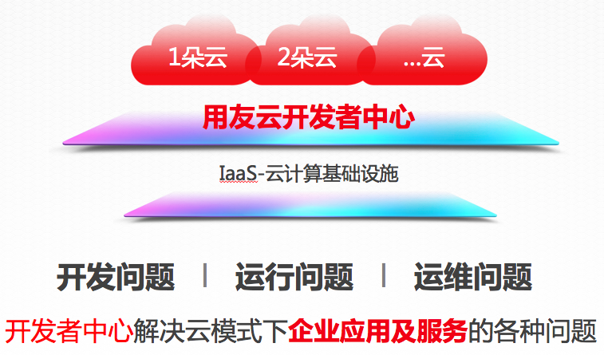
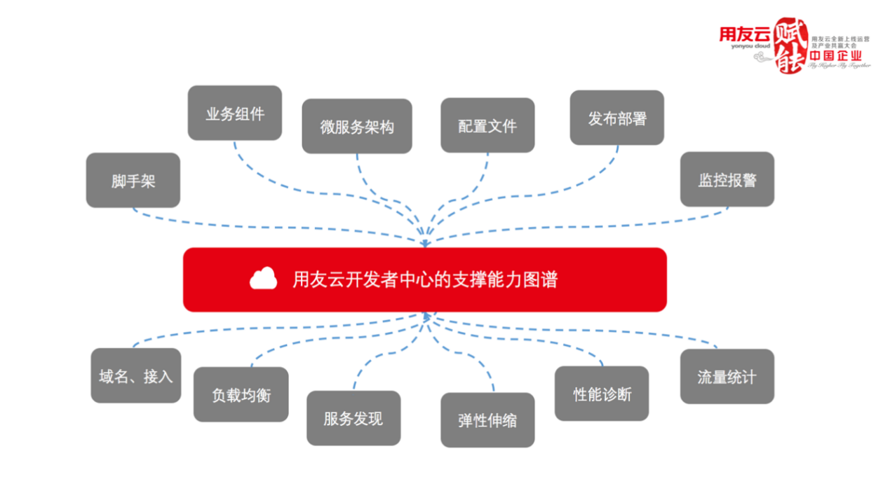
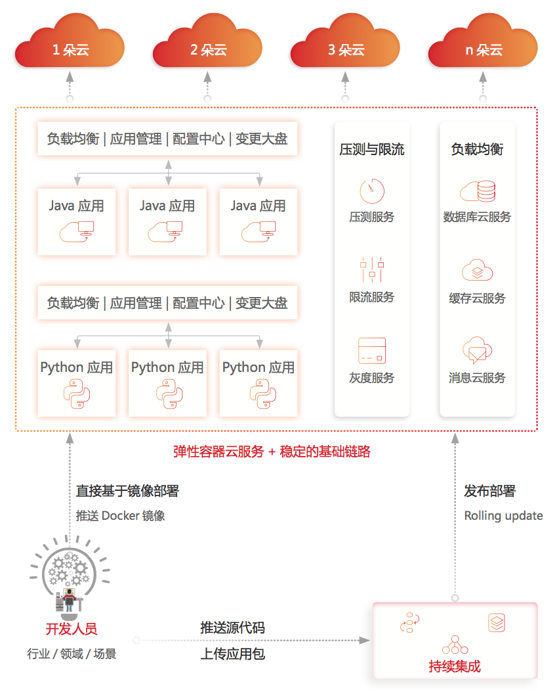

# 概述

用友云开发者中心是专为企业应用上云打造的PaaS平台，宗旨是：打造企业应用开发运维一站式服务平台。它是一个应用全生命周期管理的平台，全新的技术模式正在快速改变着公司和用户创建、发布和运行分布式应用的方式。

平台基于以Docker为代表的容器技术，打造高性能高可用的弹性云平台，提供了众多的基础组件：配置管理、发布部署、负载均衡、服务发现、域名接入、弹性伸缩等，同时通过不断的核心链路优化及监控报警、限流、服务治理等手段，使得云服务的运行更加可靠。

从DevOps的层面来看，用友云开发者中心能够完整支持应用在云上的开发、上线过程，通过多种不同的应用发布入口，充分发挥docker生态的优势，更好的符合开发者的使用习惯。

企业上云慢慢成为趋势，但企业上云又不同于toC应用，不能随便选择当时受追捧的、热的创业平台，这样容易造成上的去下不来。企业上云的脚步近年来的确可以说是如火如荼，但是企业上云需要有更好的服务支持，更持久的平台生命力，伴随一起成长。用友云开发者中心打破传统运维桎梏，实现了测试、开发、运维一体化，最终达到企业高效、敏捷、管理、精益IT服务管理的诉求。

