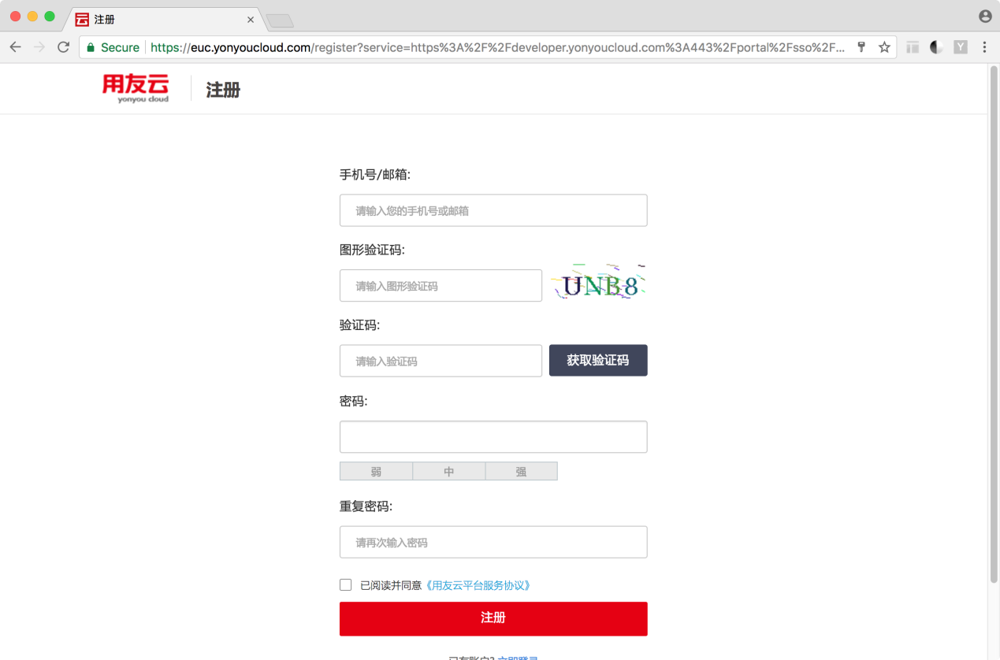

# 注册登录

输入开发者中心的网址：https://developer.yonyoucloud.com，您将看到登录页面。

如果没有账号，就注册一个全新的账号（手机号或邮箱都可以）。用友云所有旗下的产品（如云市场、开发者中心、工单等）都统一使用同一个账号，您注册完毕后，其他产品无需重复注册。  
点击上图的“注册”链接，可以跳转到注册页面，输入用于登录的手机号或邮箱及密码，就可以得到一个新账号。

