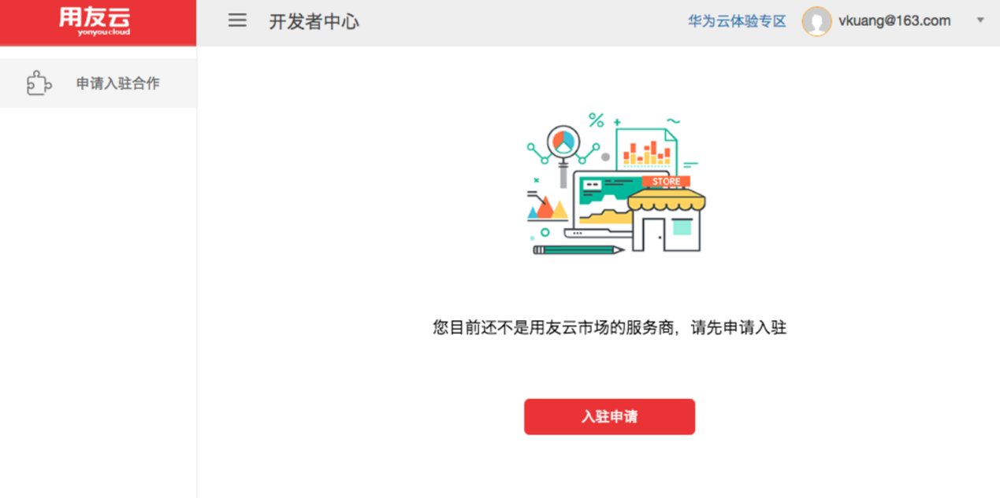
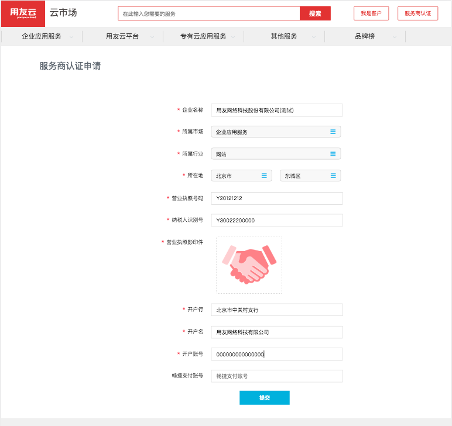
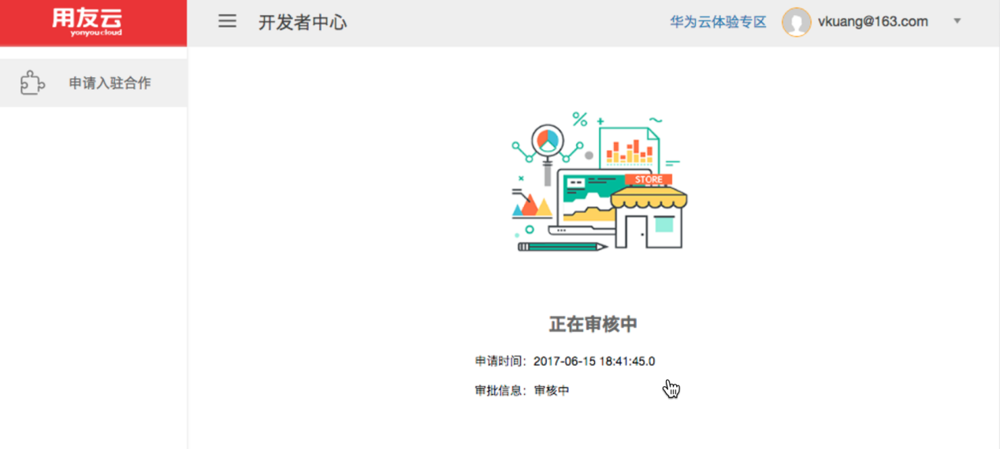
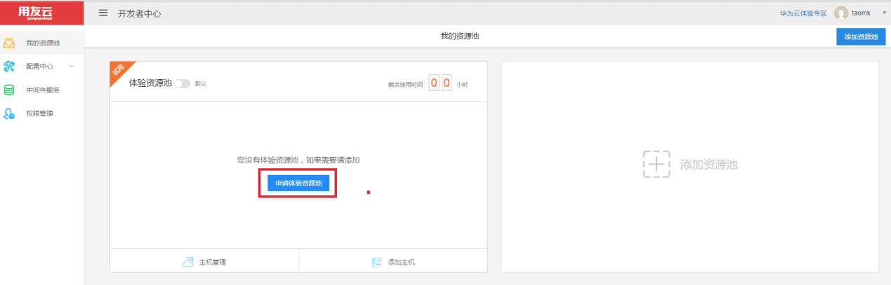

# 激活账号

拥有了用友云的账号以后，就可以登录系统了，初次登录，您会看到一个ISV认证的页面。

此时您可以选择入驻申请，也可以联系管理员（dongli2@yonyou.com），加到体验的大租户下，我们会为您开通直通车（仅限短期体验）。  
点击“入驻申请”按钮，在入驻界面输入申请信息（*为必填项），点击提交。

提示成功后回到开发者中心,刷新界面,可以看到审核状态。

审核通过后，账号就在开发者中心激活了，您将看到可以创建资源池了。点击添加资源池，可以添加一个自己的资源池。（注：如果您自己没有服务器，可以申请“体验资源池”，申请通过后，将得到一台测试服务器）

更加详细信息，请参考：  
https://iuap.yonyoucloud.com/doc/cloud_developer_center.html#/md-build/cloud_developer_center/articles/cloud/3-/resource_pool.md
