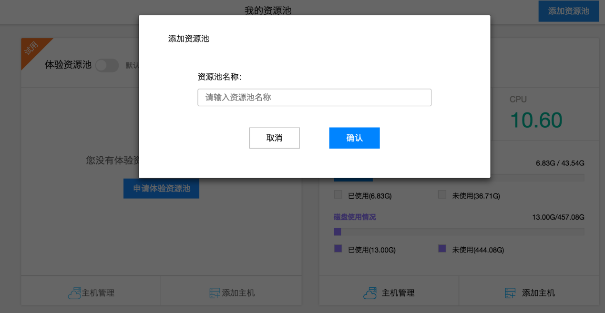

# 添加主机

如果您使用的是体验资源池，可以跳过本步骤。  
如果您自己拥有主机，您可以通过“添加资源池”功能新建自有资源池，将私有主机或者云主机添加到资源池里面。具体步骤如下：  
1.在“我的资源池”界面，点击右上角“添加资源池”按钮  
2.输入资源池的名称，点击确定，等待几秒后，即可看到新建的自有资源池。如图所示。

3.在创建的自有资源池卡片中点击“添加主机”按钮，输入主机名称,确定后进入接入脚本页面。如图所示。

 通过ssh进入要添加的linux主机，在命令行中输入接入脚本页面的shell脚本，即可自动安装接入脚本，安装状态栏显示“安装成功”后，主机完成接入。（注：请确保主机能连接至互联网）  
主机接入过程如下图所示：

打开shell客户端工具，并粘贴命令，将开始安装的过程，如下图所示：

当客户端安装完毕，网页端也会同步实时显示“主机添加成功的信息”，如下图所示：

在资源池中添加了自有主机后，您就可以开始向主机部署应用了。添加完毕后的状态，如图所示。

