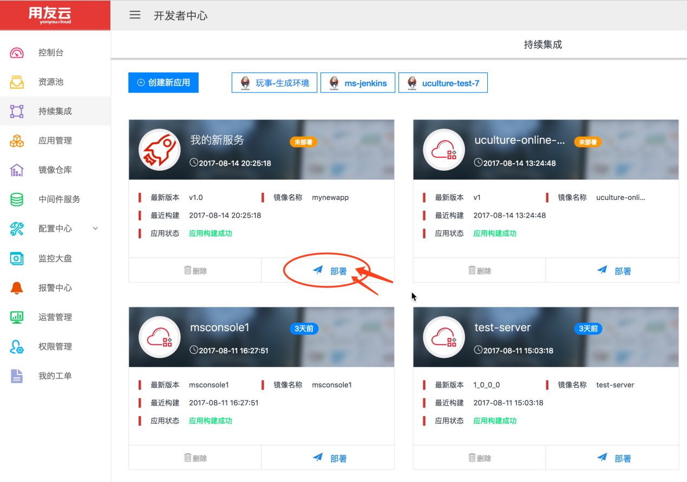
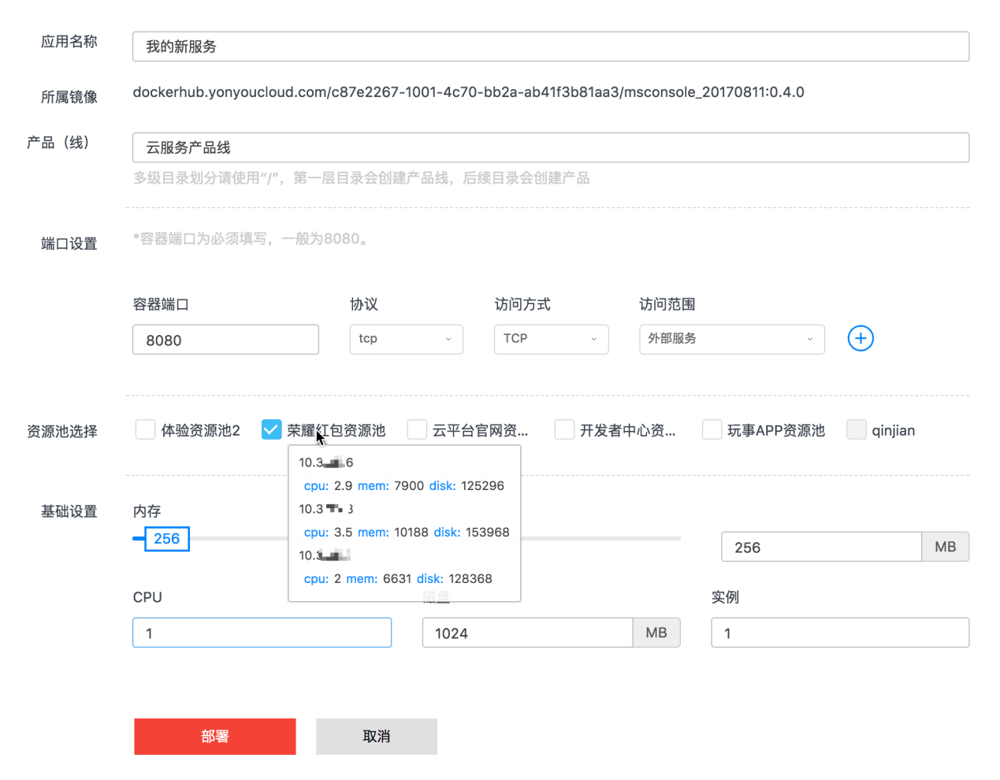
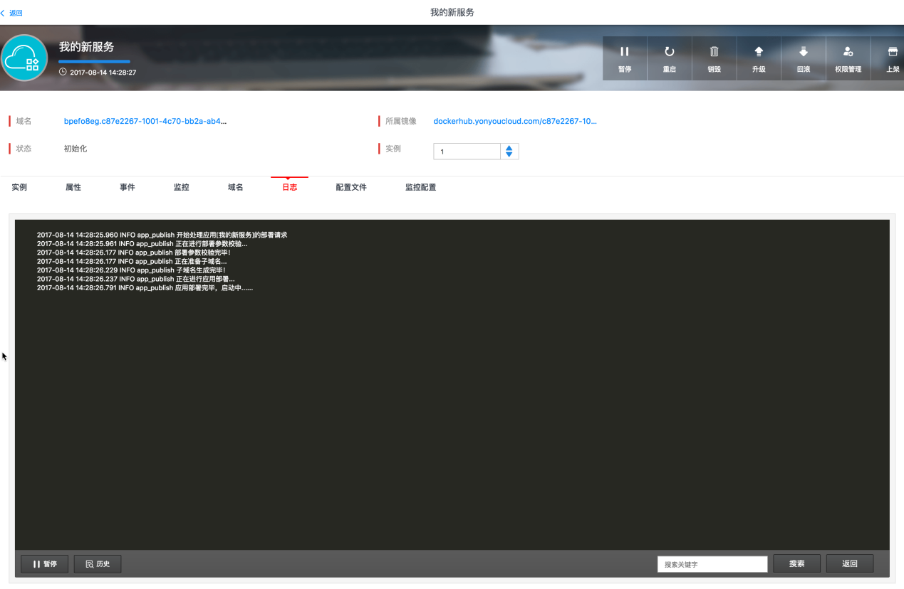
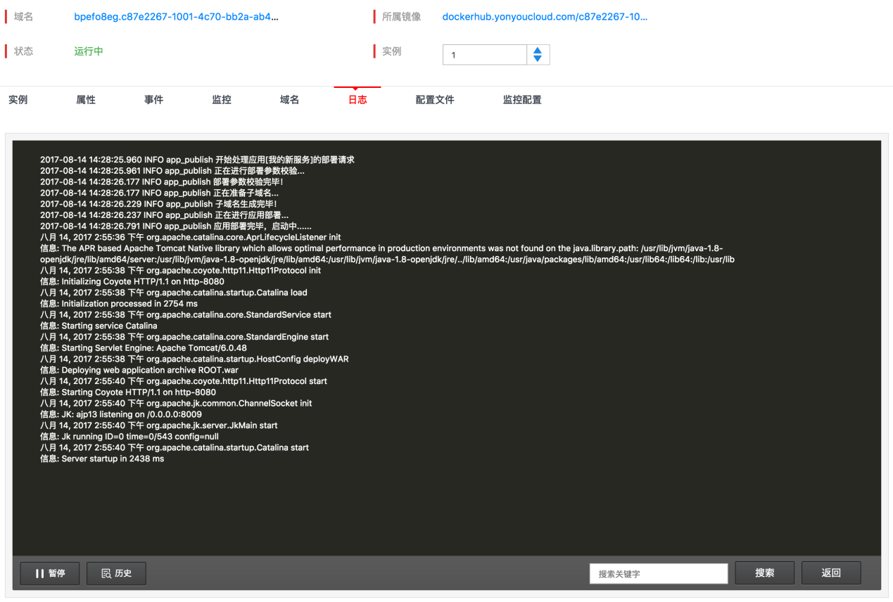

# 部署应用

 在“持续集成”中找到您已经构建成功的应用，点击“部署”按钮，进入部署界面。
 
 
 
  按需填写应用的名称、环境（开发、测试、灰度、生产）、端口设置（中间件的端口、默认tomcat用的是8080）、资源池等这些基础信息。然后再对内存（独享使用）、CPU（共享使用）、磁盘大小等运行时信息进行设置。最后指定实例数，就可以点击“部署”按钮，启动服务了。  
    相关信息的填写示例，如下图所示：

部署没有异常时，会看到如下的界面，点击“查看部署详情”，等待服务启动。

点击后，将跳转到应用管理的页面，可以看到“我的新服务”应用，正在初始化，通过“日志”标签，可以查看服务的启动日志。

当状态变为“运行中”后，说明服务就启动成功了，同时看到“日志”标签下的控制台中打印出了运行的信息。

