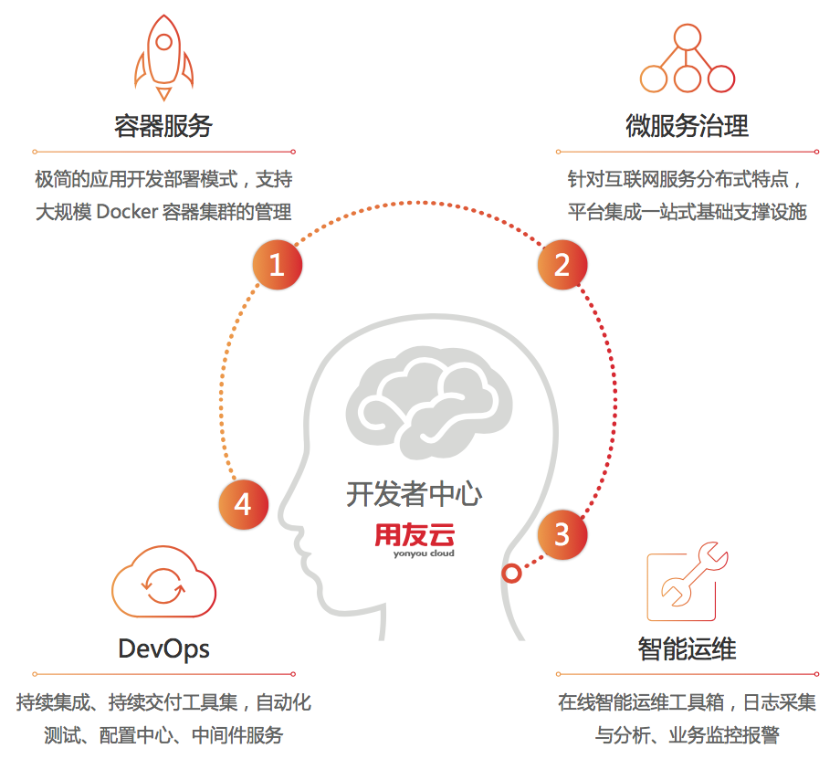
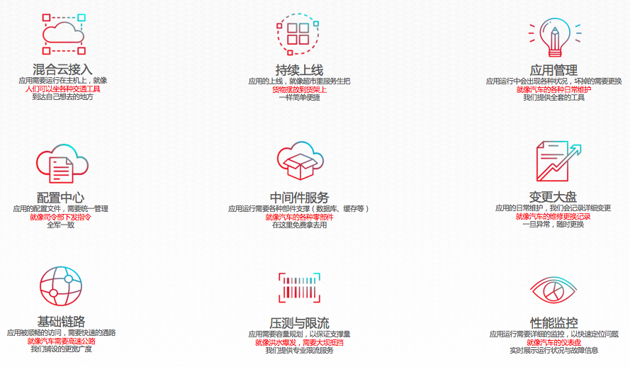

# 特性介绍

用友云开发者中心的特性主要分为容器服务、微服务治理、DevOps和智能运维四个方面。其中容器服务致力于将应用以Docker方式集群化管控，微服务治理致力于将各分布式微服务做统一管控，DevOps致力于加速产品的交付，智能运维致力于上线后应用的管理与运营。如下图所示：

细化来讲，开发者中心提供了混合云接入、持续上线、应用管理（容器服务、镜像仓库）等应用基础服务，同时为应用的微服务架构落地提供完备的支撑（配置中心、中间件服务、变更大盘），结合DevOps的理念，通过提供基础链路、压测与限流、性能监控等自动化运维能力，帮助开发及运维人员降低产品研发迭代过程中的负担。

要包括如下的特性：  
1.混合云接入：以资源池的方式进行计算节点管理，自由添加自有主机，进行智能化的资源调度与分配。  
2.持续上线：以Docker镜像为应用交付载体，一次构建，到处运行，平台自动生成子域名，让应用自由接入。  
3.应用管理：以应用为中心，简化上云过程，为应用提供扩容、缩容、升级、回滚等功能，支持服务发现、负载均衡。  
4.配置中心：开发者中心集成用友云平台的配置中心，集中管控微服务架构下应用的配置文件，支持多环境、多版本，配置变化信息实时推送等功能。  
5.中间件服务：平台提供主流的缓存、数据库、消息等中间件，开发者可按需选用支撑服务，方便快速搭建开发测试环境。  
6.变更大盘：线上运行的应用，需要不断的迭代，以增强产品能力。但是有迭代就会有变更，有变更就会有问题。变更大盘可以按版本详细记录系统的各种变更，当运维因为各种操作出现问题时，可以及时回滚，保证系统的高可用性。  
7.基础链路：为增强开发者在云上调试应用的便利，我们提供了一个稳定的基础链路，同时能够自动生成子域名，保证链路的畅通。  
8.压测与限流：为开发者提供微服务的压测、限流和降级功能，能够对流量峰值进行削峰，对应用服务进行过载保护，防止流量突发引发的系统雪崩。  
9.性能监控：平台能够自动统计应用的CPU使用率、内存使用率、网络流量等基础信息，同时也可以统计访问量情况、访客地域分布、业务的响应时间、TPS等指标，结合用户行为分析数据进行业务发展决策。
